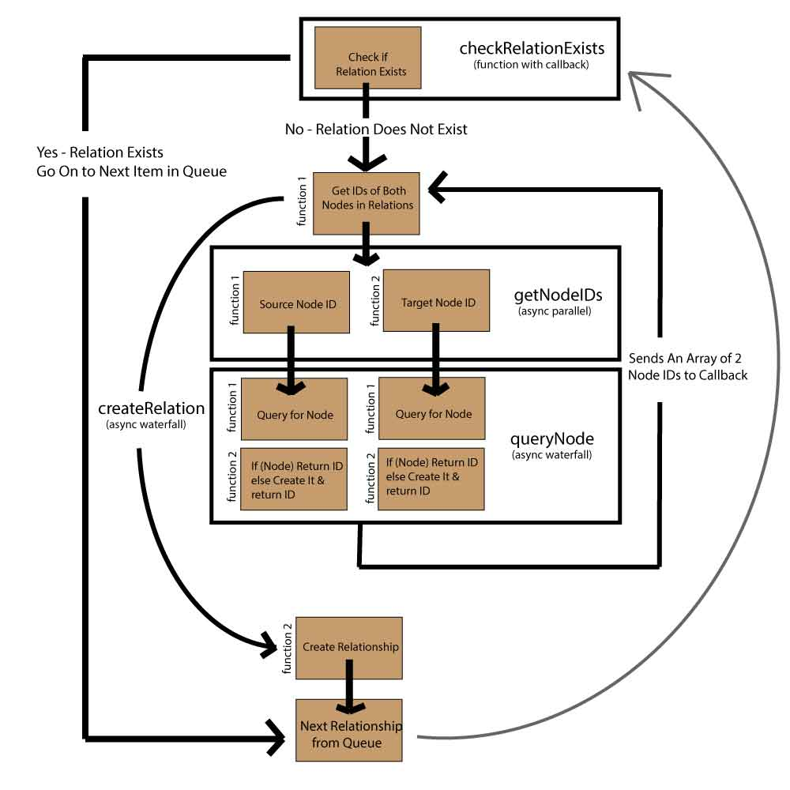

<h2>Neo4j Data Loader</h2>

A simple Node module to quickly load smalller datasets into Neo4j for analysis in the their browser application.  The module uses the Neo4j REST API (via request.js) to insert the data into the database.

Dependencies:

* async.js
* request.js

**Installation**

```javascript
npm install neo4j-loader
```

**The Basic Idea**

If you want to create a graph made up of nodes and relationships with no hanging nodes (nodes that are not connected to any other node) you can cycle over all the relationships and be assured to see all the nodes that exist in the graph.  With that in mind, using this module you can construct the entire graph by passing in objects representing each of the relationships that look like this:

```javascript
{
	"type": "INGREDIENT_IN",
	"data": {
	"info": "Some Extra Relationship Info",
	"misc": "Some Other Relationship Info"
	},
	"source": {
		"uniq": "garlic",
		"label": "Ingredient",
		"category": "vegetable",
		"name": "Garlic"
	},
	"target": {
		"uniq": "recipe1",
		"label": "Recipe",
		"name": "Recipe #1",
		"cousine": "Mexican"
	}
}
```

For each relationship object like the above, the module will check to see if the nodes exist (using the "uniq" property) and create them if need be and then create the relationship. Only the "type" is required (the "data" property can be an empty object) on the relationship.  The source and target objects must have a "uniq" (a unique ID across all nodes) and a "label" property.

Beyond that, you can have as many properties as you want in the relationship data and the source and target objects.  Neo4j won't accept empty arrays or objects on the properties.  The code always checks to see if the relationship and/or nodes exist before creating them, so you can stop and restart the bulk loading and it will pick up from where it left off without duplicating data.

**API**

There are only three methods to the API (insertFile, setURL, addToQueue), so it is very easy to use.  Basically, you can use it to load data from a JSON file or in the context of a larger script - sending each realtionship to the queue manually. The module will begin processing items in the queue immediately upon receiving them.

***Loading from a JSON file***

```javascript
var loader = require("neo4j-loader");

var inputFile = 'data/relationships.json';
var dataURL = 'http://localhost:7474/db/data/';

loader.insertFile(inputFile, dataURL);
```

***Add Each to Queue Manually***

```javascript
var fs = require('fs');
var loader = require("neo4j-loader");

var inputFile = 'data/relationships.json';
var dataURL = 'http://localhost:7474/db/data/';

// Make sure you set the URL first.
loader.setURL(dataURL); 

fs.readFile(inputFile, 'utf-8', function (err, data) {
  if (err) throw err;
  var relations = JSON.parse(data);
  relations.forEach(function (relation) {
      loader.addToQueue(relation);
  });
});
```

**How it Works**

A basic sketch of the process used by the module looks like this: 




